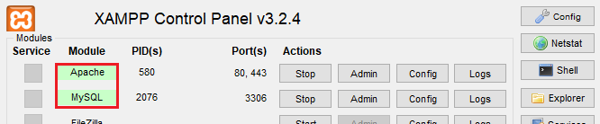

# PROJETO DML - (DEMOGRAFIA DA MICRORREGIÃO DE LAVRAS-MG)

### Sobre

Este site foi desenvolvido em parceria com um projeto de iniciação científica (BIC Jr) realizado no [CEFET MG Campus IX - Nepomuceno](https://www.nepomuceno.cefetmg.br), cujo objetivo é apresentar as informações demográficas das microrregiões de Lavras-MG, coletadas no site do IBGE, de forma mais visual.


### 📌 Conteúdo

* [Sobre](#sobre)
* [Status](#status)
* [Características](#características)
* [Requisitos](#requisitos)
* [Tecnologias](#tecnologias)
* [Autor](#autor)
* [Licença](#licença)


### Status

Projeto concluído ✅


### Características

- [x] Página inicial
- [x] Enviando feedback
- [x] Visualização de tabela
- [x] Visualização do mapa


### Requisitos

1. Para rodar o aplicativo é necessário instalar a plataforma de software livre [XAMPP](https://www.apachefriends.org) ou **LAMPP**.

2. Acesse a pasta htdosc dentro da pasta xampp via terminal / cmd.

- Linux
```bash
    $ cd /opt/lampp/htdocs
```

- Windows
```powershell
    $ cd C:\xampp\htdocs
```

3. Clone este repositório dentro da pasta htdocs.

- Linux e Windows
```bash
    $ git clone https://github.com/MatheusBibiano/DML-Project.git
```

4. O próximo passo é acessar o painel de controle do xampp e iniciar dois serviços: **Apache** e **MySQL**.


5. Para configurar o acesso ao banco de dados acesse **http://localhost/phpmyadmin/server_sql.php** a partir do navegador. Copie e cole todo o conteúdo do arquivo **db.sql** na guia **SQL** e clique em **executar**.

6. Quando tudo já estiver configurado, basta acessar **http://localhost/DML/src/view/home/** para visualizar a aplicação em operação.


### Tecnologias

As seguintes tecnologias foram utilizadas na construção do projeto:

- [HTML5](https://www.w3schools.com/html/)
- [CSS3](https://www.w3schools.com/css/)
- [PHP](https://www.php.net)
- [MySQL](https://www.mysql.com)


### Autor


Matheus Bibiano Alves

[](https://www.linkedin.com/in/matheus-bibiano-alves) [](https://www.facebook.com/matheus.bibiano1/) [](https://twitter.com/Bibiano_Alves)


### Licença

[MIT](https://choosealicense.com/licenses/mit/)